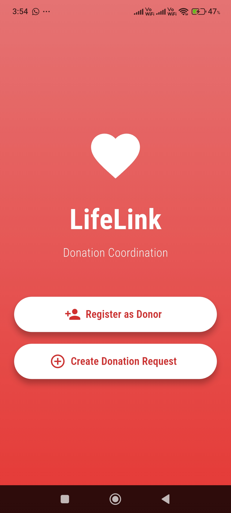
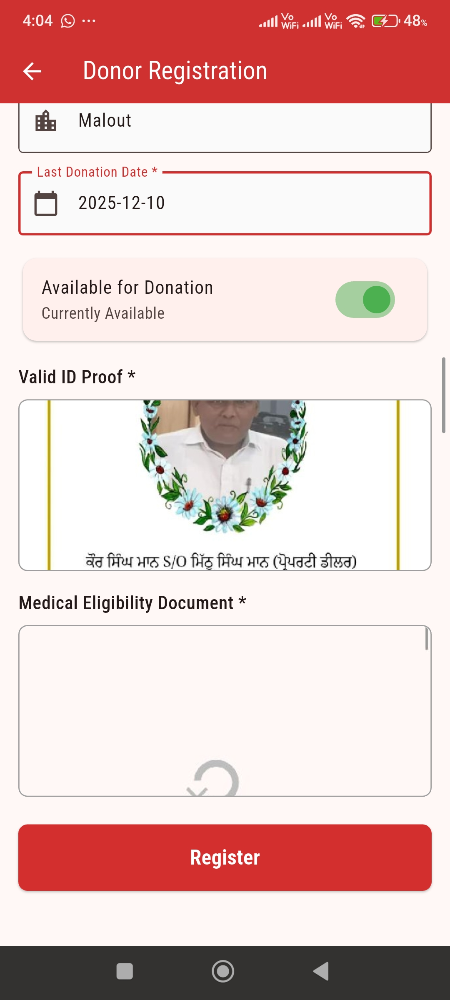
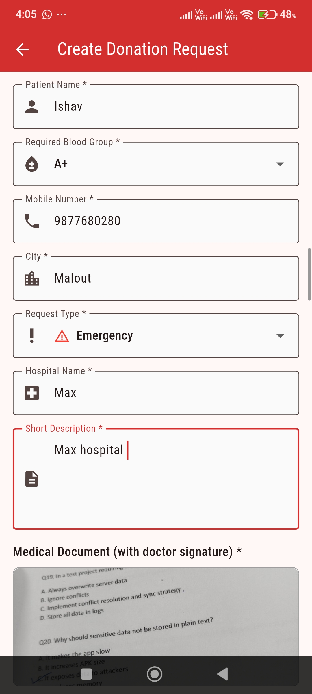
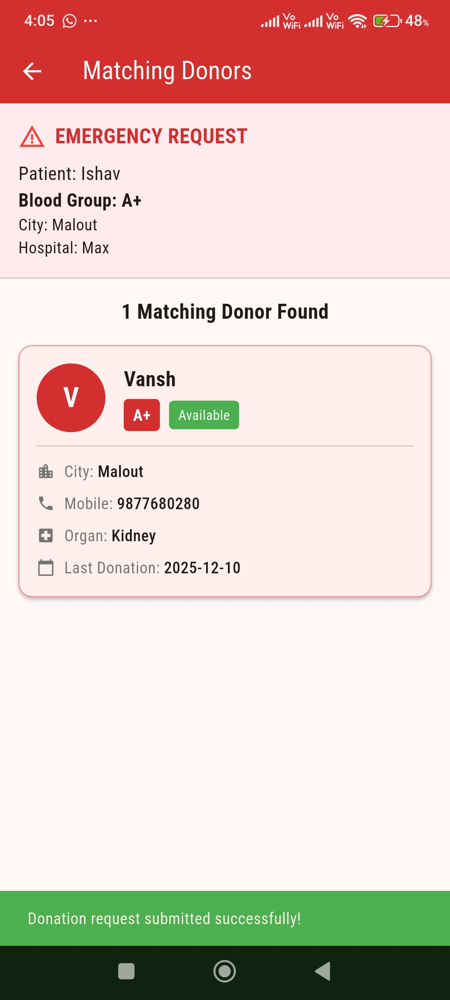

# LifeLink Donation Coordination App

## Overview
LifeLink is an offline mobile application for donor registration and donation request management. The app allows users to register as donors and create donation requests for blood or organs, operating entirely offline with local data storage.

## Features
- **Welcome Screen**: Entry point with options to register as donor or create donation request
- **Donor Registration**: Register donors with complete medical and contact information
- **Donation Request Creation**: Create blood/organ donation requests with medical documentation
- **Donor Matching**: Automatically match donors based on blood group, location, and availability

## Technical Specifications

### Platform & SDK Version
- **Flutter SDK**: 3.10.4 or higher
- **Dart**: ^3.10.4
- **Target Platform**: Android
- **Minimum SDK**: Android API 21 (Android 5.0 Lollipop)
- **Target SDK**: Latest (configured via Flutter)
- **Compile SDK**: Latest (configured via Flutter)

### Key Dependencies
```yaml
dependencies:
  flutter: sdk: flutter
  cupertino_icons: ^1.0.8
  path_provider: ^2.1.5      # For local file storage
  image_picker: ^1.2.1        # For capturing/selecting images
  uuid: ^4.5.2                # For generating unique IDs
```

## Building the App from Source

### Prerequisites
1. Install Flutter SDK (version 3.10.4 or higher)
   - Download from: https://flutter.dev/docs/get-started/install
   - Add Flutter to your PATH
2. Install Android Studio or Android SDK
3. Install a code editor (VS Code or Android Studio recommended)

### Build Steps

#### 1. Clone/Extract the Repository
```bash
cd path/to/LifeLink_Donation_Coordination_App
```

#### 2. Install Dependencies
```bash
flutter pub get
```

#### 3. Verify Flutter Installation
```bash
flutter doctor
```
Ensure all checks pass, especially Android toolchain.

#### 4. Build APK (Debug)
```bash
flutter build apk --debug
```
Output: `build/app/outputs/flutter-apk/app-debug.apk`

#### 5. Build APK (Release)
```bash
flutter build apk --release
```
Output: `build/app/outputs/flutter-apk/app-release.apk`

#### 6. Build App Bundle (for Play Store)
```bash
flutter build appbundle --release
```
Output: `build/app/outputs/bundle/release/app-release.aab`

### Running the App
```bash
# Connect Android device or start emulator
flutter devices

# Run in debug mode
flutter run

# Run in release mode
flutter run --release
```

## Local JSON Storage Implementation

### JSON File Location
- **Asset Storage**: `assets/resource/`
  - `donors.json` - Initial donor data template
  - `donation_requests.json` - Initial donation requests template

- **Runtime Storage**: Application Documents Directory
  - Android: `/data/data/com.example.lifelink_donation_app/app_flutter/`
  - iOS: `Library/Application Support/`
  
### JSON Parsing Approach

#### Initialization
1. On first launch, JSON files are copied from `assets/resource/` to the application documents directory
2. Subsequent reads/writes operate on the local files in the documents directory
3. Uses `path_provider` package to get platform-specific storage paths

#### Storage Service (`lib/services/local_storage_service.dart`)
```dart
LocalStorageService
├── initializeStorage()        // Copy from assets if needed
├── saveDonor()                // Add new donor
├── getAllDonors()             // Retrieve all donors
├── saveDonationRequest()      // Add new request
├── getAllDonationRequests()   // Retrieve all requests
└── matchDonors()              // Match donors to requests
```

## Storage Schema

### Donor Schema
```json
{
  "id": "string (UUID)",
  "fullName": "string",
  "idProofImagePath": "string (file path)",
  "organ": "string",
  "bloodGroup": "string (A+, A-, B+, B-, AB+, AB-, O+, O-)",
  "mobileNumber": "string",
  "city": "string",
  "lastDonationDate": "string (ISO 8601 date)",
  "medicalEligibilityImagePath": "string (file path)",
  "availabilityStatus": "boolean"
}
```

**Fields Explanation:**
- `id`: Unique identifier generated using UUID package
- `fullName`: Donor's full legal name
- `idProofImagePath`: Local file system path to ID proof image
- `organ`: Type of donation (Blood, Kidney, Liver, Heart, Lungs, Pancreas, Cornea, Bone Marrow)
- `bloodGroup`: Blood type classification
- `mobileNumber`: Contact number (validated for 10 digits)
- `city`: Donor's city/area for location-based matching
- `lastDonationDate`: Date of last donation (used for eligibility calculations)
- `medicalEligibilityImagePath`: Path to medical certificate/document image
- `availabilityStatus`: Current availability for donation (toggle)

### Donation Request Schema
```json
{
  "id": "string (UUID)",
  "patientName": "string",
  "bloodGroup": "string",
  "medicalDocumentImagePath": "string (file path)",
  "mobileNumber": "string",
  "requestType": "string (Emergency or Planned)",
  "hospitalName": "string",
  "description": "string",
  "city": "string",
  "timestamp": "string (ISO 8601 datetime)"
}
```

**Fields Explanation:**
- `id`: Unique identifier for the request
- `patientName`: Name of the patient requiring donation
- `bloodGroup`: Required blood group for matching
- `medicalDocumentImagePath`: Path to doctor's medical prescription/certificate
- `mobileNumber`: Requester's contact number
- `requestType`: Priority level - "Emergency" (urgent) or "Planned" (future)
- `hospitalName`: Hospital where donation is needed
- `description`: Brief description of medical situation
- `city`: Hospital/patient location for donor matching
- `timestamp`: Request creation time

## Image Storage Implementation

### Image Capture/Selection
- **Library Used**: `image_picker: ^1.2.1` (provided external library)
- **Sources**: Camera or Gallery
- **Method**: System image picker intents only (no third-party libraries)

### Image Storage Process
1. **Selection**: User selects/captures image via system picker
2. **Copy**: Image is copied from temporary location to application documents directory
3. **Naming**: Images are saved with UUID-based filenames to avoid conflicts
4. **Format**: Original format preserved (JPEG/PNG)
5. **Path Storage**: Only the file path is stored in JSON, not the image data

### Image File Organization
```
Application Documents Directory/
├── images/
│   ├── id_proof_<uuid>.jpg
│   ├── medical_cert_<uuid>.jpg
│   └── medical_doc_<uuid>.jpg
├── donors.json
└── donation_requests.json
```

### Image Retrieval
- Images are loaded from stored file paths using `File(path)`
- Displayed using `Image.file()` widget in Flutter
- Handles missing files gracefully with placeholder images

## Permissions Used

### Required Permissions
The app requires the following permissions, handled by the `image_picker` package:

#### Android Permissions (Auto-configured)
1. **CAMERA** - For capturing new photos
   ```xml
   <uses-permission android:name="android.permission.CAMERA"/>
   ```

2. **READ_EXTERNAL_STORAGE** - For selecting photos from gallery (Android < 13)
   ```xml
   <uses-permission android:name="android.permission.READ_EXTERNAL_STORAGE"/>
   ```

3. **READ_MEDIA_IMAGES** - For selecting photos (Android 13+)
   ```xml
   <uses-permission android:name="android.permission.READ_MEDIA_IMAGES"/>
   ```

### Permission Denial Handling

#### Implementation Strategy
The `image_picker` package handles permission requests automatically. Our app implements graceful fallback:

1. **Camera Permission Denied**:
   - User can still select from gallery
   - Inline message prompts to enable camera access in settings
   - Registration can proceed without ID proof image (validation allows optional images)

2. **Gallery Permission Denied**:
   - User can still capture new photo with camera
   - Inline message guides user to settings
   - Alternative: user can proceed without images if absolutely necessary

3. **All Permissions Denied**:
   - User is shown a dialog explaining:
     - Why permissions are needed
     - How to enable in device settings
     - Option to proceed without images (degraded functionality warning)
   - Forms remain functional but without image upload capability

#### Code Implementation Example
```dart
// In donor_registration_screen.dart and donation_request_screen.dart
Future<void> _pickImage({required bool isCamera}) async {
  try {
    final XFile? image = await _imagePicker.pickImage(
      source: isCamera ? ImageSource.camera : ImageSource.gallery,
      maxWidth: 1920,
      maxHeight: 1080,
      imageQuality: 85,
    );
    
    if (image != null) {
      // Process and store image
    }
    // If image is null, user cancelled - no error shown
  } catch (e) {
    // Permission denied or error occurred
    if (mounted) {
      ScaffoldMessenger.of(context).showSnackBar(
        SnackBar(
          content: Text('Unable to access ${isCamera ? 'camera' : 'gallery'}. '
                       'Please check permissions in Settings.'),
          action: SnackBarAction(
            label: 'OK',
            onPressed: () {},
          ),
        ),
      );
    }
  }
}
```

#### User Experience Flow
1. User taps image picker button
2. System requests permission (first time only)
3. If granted: Image picker opens normally
4. If denied: 
   - Snackbar appears with explanation
   - User can retry or proceed without image
   - Form validation allows submission without image (marked as optional)

## Donor Matching Algorithm

### Matching Criteria (Priority Order)
1. **Blood Group Match**: Donor's blood group must exactly match request
2. **Location Match**: Donor must be in the same city as hospital/patient
3. **Availability Status**: Donor must be marked as available (`availabilityStatus: true`)
4. **Request Priority**: Emergency requests are prioritized in display

### Matching Implementation
```dart
Future<List<Donor>> matchDonors({
  required String bloodGroup,
  required String city,
  required bool isEmergency,
}) async {
  final donors = await getAllDonors();
  
  return donors.where((donor) {
    return donor.bloodGroup == bloodGroup &&
           donor.city.toLowerCase() == city.toLowerCase() &&
           donor.availabilityStatus == true;
  }).toList();
}
```

## App Architecture

### Directory Structure
```
lib/
├── main.dart                          # App entry point
├── models/                            # Data models
│   ├── donor.dart                     # Donor model with JSON serialization
│   └── donation_request.dart          # Request model with JSON serialization
├── screens/                           # UI screens
│   ├── welcome_screen.dart            # Landing page
│   ├── donor_registration_screen.dart # Donor registration form
│   ├── donation_request_screen.dart   # Request creation form
│   └── donor_matching_screen.dart     # Matching results display
└── services/                          # Business logic
    └── local_storage_service.dart     # Local JSON storage handler

assets/
└── resource/                          # Initial JSON templates
    ├── donors.json                    # Empty array or sample donors
    └── donation_requests.json         # Empty array or sample requests
```

## Design Decisions

### Why Offline-First Architecture?
- **No Network Dependency**: Works in areas with poor connectivity
- **Privacy**: All data remains on device
- **Speed**: Instant data access without API latency
- **Simplicity**: No backend infrastructure needed
- **Cost**: Zero server/hosting costs

### Why JSON File Storage?
- **Lightweight**: No database overhead
- **Portable**: Easy to backup and transfer
- **Readable**: Human-readable format for debugging
- **Flutter Compatible**: Native JSON encoding/decoding support
- **No External Dependencies**: Uses built-in Dart libraries

### Trade-offs
- **Scalability**: Limited by device storage (adequate for local coordination)
- **Multi-device Sync**: Not supported (intentional for offline operation)
- **Data Loss Risk**: Mitigated by using stable application documents directory

## Testing the App

### Test Scenarios
1. **Donor Registration**:
   - Fill all required fields
   - Upload ID proof and medical eligibility images
   - Verify data persists after app restart

2. **Donation Request**:
   - Create emergency and planned requests
   - Upload medical document image
   - Check storage in JSON file

3. **Donor Matching**:
   - Create request and register matching donor
   - Verify match appears in results
   - Test filtering by blood group and city

4. **Permission Handling**:
   - Deny camera permission and verify gallery still works
   - Deny all permissions and verify graceful degradation

### Debug Commands
```bash
# View logs
flutter logs

# Clear app data (testing fresh install)
adb shell pm clear com.example.lifelink_donation_app

# View stored JSON files
adb shell run-as com.example.lifelink_donation_app cat app_flutter/donors.json
```

## Troubleshooting

### Common Issues

**Issue**: "Gradle build failed"
- **Solution**: Update Android SDK tools via Android Studio

**Issue**: "Image picker not working"
- **Solution**: Check AndroidManifest.xml has required permissions
- Run `flutter clean` and `flutter pub get`

**Issue**: "JSON file not found"
- **Solution**: Verify files exist in `assets/resource/`
- Check `pubspec.yaml` includes asset declarations

**Issue**: "App crashes on launch"
- **Solution**: Check Flutter doctor for environment issues
- View logs with `flutter logs`

## Screenshots

### 1. Welcome Screen


The entry point of the app with options to register as a donor or create a donation request.

### 2. Donor Registration Screen


Complete form for registering donors with medical and contact information, image uploads, and availability toggle.

### 3. Create Donation Request Screen


Form to create blood/organ donation requests with patient details, medical documentation, and priority level.

### 4. Donor Matching Screen


Displays matched donors based on blood group, location, and availability status with emergency priority handling.

### 5. Matched Donor Details


Detailed view of matched donors showing donor information and contact details for coordination.

## Submission Checklist
- ✅ Source code (complete project folder)
- ✅ Build artifact (APK file)
- ✅ README.md with comprehensive documentation
- ✅ Screenshots of all major screens
- ✅ Local JSON files in `assets/resource/`
- ✅ File naming: `XX_Lifelink_App.apk`

## License
This project is developed for educational/coordination purposes.

## Contact & Support
For issues or questions, refer to project documentation or contact the development team.

---
**Version**: 1.0.0  
**Last Updated**: December 2025  
**Built With**: Flutter ❤️
